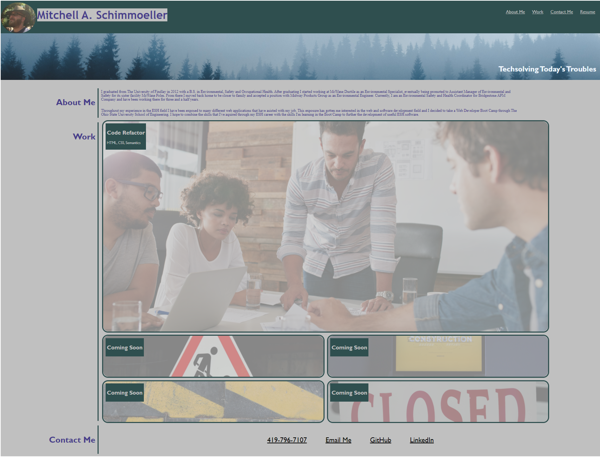

# Mitch Schimmoeller: Portfolio

This portfolio was built from the ground up using the many HTML and CSS lessons learned so far through the Coding Bootcamp. It is designed to be responsive to the end user in that it will link to different sections of the page using the navigation bar. It also contains many different links that will allow a potential employer to contact me and view my previous works. Eventually this project will act as a portal to my many projects and showcase the skills I learn as I continue through the course. 

[Mitch Schimmoeller Portfolio](https://schimmoellerm.github.io/mitch-schimmoeller-portfolio/)

## Built With

* [VSCode](https://code.visualstudio.com/) - Code editing software
* [GitBash](https://gitforwindows.org/) - Command line interface

## Lessons Learned

This project was both frustrating and rewarding. It took a lot of trial and error to get it to where I wanted it to be. Even then its not quite what I want it to be, but with additional time and practice 

## Authors

* **Mitch Schimmoeller** - *Site Architect and Programmer* - [Schimmoellerm](https://github.com/Schimmoellerm)

## Credits 

* **Unsplash** - *Photos for Everyone* - [Unsplash](https://unsplash.com/)

    This site provides free professional photographs for anyone to use. 
        *Mark Konig* - Caution Digging Sign
        *Matthew Feeney* - Closed Sign
        *Pop Zebra* - Caution Pattern
        *Roberto Motoi* - Pine Forest
        *Webfactory* - Under Construction Laptop

## Acknowledgments

* The OSU coding boot camp, its Instructor and TAs who fielded questions regarding this assignment.
* My fellow classmates for providing thoughts and ideas on how to get the site to perform how I wanted it to.  
